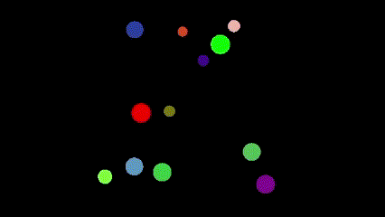

# Simple Collision Simulation

The project is a simple physics engine that only detects the collision between n particles.
I use CCD (Continuous Collision Detection) to detect the collision with the edges.
And a Sweep and Prune algorithm between each particle.
I use Python OpenGl to represent the particles visually.

## Demo

